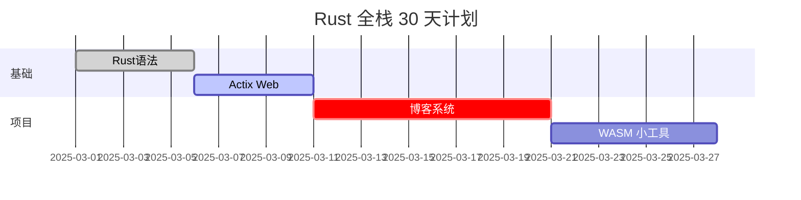

# DeepseekV3-0324（free）
基于你 **7年C语言基础** 和 **追求极致性价比** 的需求，我为你设计了一套 **全栈独立开发路线**，聚焦 **快速产品上线**、**低成本高可控** 的技术组合。以下是分阶段规划：

---

### **一、技术选型原则**
1. **最大化复用C语言经验**：优先选择C友好或高性能后端技术。
2. **低成本快速迭代**：选择轻量级、易部署、生态成熟的技术栈。
3. **全栈能力覆盖**：从前端到后端再到运维，最小化依赖第三方服务。

---

### **二、推荐技术栈**
#### **1. 后端开发（你的强项）**
- **语言/框架**：
  - **Go (Gin/Echo)**：语法接近C，高性能，适合快速开发API。
  - **Rust (Actix/Axum)**：内存安全+高性能，适合长期维护（学习曲线略陡）。
  - *备选*：C++ (Qt/Pistache) 或 Node.js (Express/Fastify)（若需快速原型）。
- **数据库**：
  - **SQLite**：单文件、零配置，适合早期产品（支持ACID）。
  - **PostgreSQL**：功能全面，免费，适合复杂业务。
- **API协议**：RESTful（易上手）或 GraphQL（灵活查询）。

#### **2. 前端开发（性价比优先）**
- **基础技术**：
  - **HTML/CSS/JavaScript**：必学，无需框架也能开发简单界面。
- **轻量级框架**：
  - **Vue 3 + Pinia**：响应式开发快，学习曲线平缓。
  - **Svelte**：编译为原生JS，无运行时开销，适合性能敏感场景。
- **UI组件库**：
  - **Tailwind CSS**：原子化CSS，快速定制界面（省去设计成本）。
  - **DaisyUI**：基于Tailwind的预制组件，开箱即用。

#### **3. 部署与运维**
- **服务器**：
  - **轻量VPS**：如腾讯云/阿里云轻量服务器（≈$5/月）。
  - **Serverless**：Vercel（前端）、Cloudflare Workers（边缘计算）。
- **容器化**：
  - **Docker**：标准化部署，避免环境问题。
- **监控**：
  - **Prometheus + Grafana**（开源，自建监控）。
  - **Uptime Kuma**：自托管服务状态检测。

#### **4. 辅助工具**
- **开发工具**：VS Code + GitHub Copilot（代码补全提速）。
- **低代码/无代码**：
  - **Appsmith**：快速搭建管理后台。
  - **Webflow**：无代码设计落地页（节省前端时间）。

---

### **三、分阶段学习路径**
#### **阶段1：快速原型（1-2周）**
- 目标：用最小成本验证产品可行性。
- 技术组合：
  - 后端：Go + SQLite（或直接使用C++写核心逻辑）。
  - 前端：纯HTML/CSS + 原生JS（避免框架学习成本）。
  - 部署：Vercel静态托管 + VPS跑后端。

#### **阶段2：产品化（1-3个月）**
- 目标：完善功能，提升用户体验。
- 技术升级：
  - 前端：引入Vue 3 + Tailwind CSS。
  - 后端：Go/Python + PostgreSQL（如需复杂查询）。
  - 运维：Docker容器化 + GitHub Actions自动化部署。

#### **阶段3：长期维护（持续优化）**
- 性能优化：Rust重写关键模块（如高频API）。
- 扩展性：微服务化（Kubernetes若需横向扩展）。
- 成本控制：自建CDN（Cloudflare免费层）、冷存储备份。

---

### **四、避坑指南**
1. **避免过度工程化**：早期不用K8s、微服务。
2. **谨慎选云服务**：AWS/Azure可能超预算，优先用国产云厂商优惠。
3. **少造轮子**：复用开源项目（如Admin后台用Appsmith）。

---

### **五、推荐学习资源**
- **Go**：《Go语言实战》+ [Go by Example](https://gobyexample.com/)
- **Vue 3**：官方文档 + [Vue Mastery](https://www.vuemastery.com/)
- **SQLite**：《SQLite权威指南》（利用C经验直接调用SQLite C API）
- **部署实战**：《Docker——从入门到实践》（中文开源书）

---

### **六、案例参考**
- **C程序员转型**：Notion的早期版本用Go+React，SQLite存储。
- **极致性价比**：Plausible Analytics（Go+PostgreSQL+Vue，单服务器支撑百万流量）。

---

通过这套路线，你可以用 **C语言思维** 快速过渡到全栈开发，同时控制技术风险和成本。如果需要具体领域（如游戏、工具软件）的细化方案，可以进一步沟通！


基于你 **7年C语言基础** 和 **追求极致性价比** 的需求，我为你设计了一套 **全栈独立开发路线**，聚焦 **快速产品上线**、**低成本高可控** 的技术组合。以下是分阶段规划：

---
# Deepseek V3-0324
### **一、技术选型原则**
1. **最大化复用C语言经验**：优先选择C友好或高性能后端技术。
2. **低成本快速迭代**：选择轻量级、易部署、生态成熟的技术栈。
3. **全栈能力覆盖**：从前端到后端再到运维，最小化依赖第三方服务。

---

### **二、推荐技术栈**
#### **1. 后端开发（你的强项）**
- **语言/框架**：
  - **Go (Gin/Echo)**：语法接近C，高性能，适合快速开发API。
  - **Rust (Actix/Axum)**：内存安全+高性能，适合长期维护（学习曲线略陡）。
  - *备选*：C++ (Qt/Pistache) 或 Node.js (Express/Fastify)（若需快速原型）。
- **数据库**：
  - **SQLite**：单文件、零配置，适合早期产品（支持ACID）。
  - **PostgreSQL**：功能全面，免费，适合复杂业务。
- **API协议**：RESTful（易上手）或 GraphQL（灵活查询）。

#### **2. 前端开发（性价比优先）**
- **基础技术**：
  - **HTML/CSS/JavaScript**：必学，无需框架也能开发简单界面。
- **轻量级框架**：
  - **Vue 3 + Pinia**：响应式开发快，学习曲线平缓。
  - **Svelte**：编译为原生JS，无运行时开销，适合性能敏感场景。
- **UI组件库**：
  - **Tailwind CSS**：原子化CSS，快速定制界面（省去设计成本）。
  - **DaisyUI**：基于Tailwind的预制组件，开箱即用。

#### **3. 部署与运维**
- **服务器**：
  - **轻量VPS**：如腾讯云/阿里云轻量服务器（≈$5/月）。
  - **Serverless**：Vercel（前端）、Cloudflare Workers（边缘计算）。
- **容器化**：
  - **Docker**：标准化部署，避免环境问题。
- **监控**：
  - **Prometheus + Grafana**（开源，自建监控）。
  - **Uptime Kuma**：自托管服务状态检测。

#### **4. 辅助工具**
- **开发工具**：VS Code + GitHub Copilot（代码补全提速）。
- **低代码/无代码**：
  - **Appsmith**：快速搭建管理后台。
  - **Webflow**：无代码设计落地页（节省前端时间）。

---

### **三、分阶段学习路径**
#### **阶段1：快速原型（1-2周）**
- 目标：用最小成本验证产品可行性。
- 技术组合：
  - 后端：Go + SQLite（或直接使用C++写核心逻辑）。
  - 前端：纯HTML/CSS + 原生JS（避免框架学习成本）。
  - 部署：Vercel静态托管 + VPS跑后端。

#### **阶段2：产品化（1-3个月）**
- 目标：完善功能，提升用户体验。
- 技术升级：
  - 前端：引入Vue 3 + Tailwind CSS。
  - 后端：Go/Python + PostgreSQL（如需复杂查询）。
  - 运维：Docker容器化 + GitHub Actions自动化部署。

#### **阶段3：长期维护（持续优化）**
- 性能优化：Rust重写关键模块（如高频API）。
- 扩展性：微服务化（Kubernetes若需横向扩展）。
- 成本控制：自建CDN（Cloudflare免费层）、冷存储备份。

---

### **四、避坑指南**
1. **避免过度工程化**：早期不用K8s、微服务。
2. **谨慎选云服务**：AWS/Azure可能超预算，优先用国产云厂商优惠。
3. **少造轮子**：复用开源项目（如Admin后台用Appsmith）。

---

### **五、推荐学习资源**
- **Go**：《Go语言实战》+ [Go by Example](https://gobyexample.com/)
- **Vue 3**：官方文档 + [Vue Mastery](https://www.vuemastery.com/)
- **SQLite**：《SQLite权威指南》（利用C经验直接调用SQLite C API）
- **部署实战**：《Docker——从入门到实践》（中文开源书）

---

### **六、案例参考**
- **C程序员转型**：Notion的早期版本用Go+React，SQLite存储。
- **极致性价比**：Plausible Analytics（Go+PostgreSQL+Vue，单服务器支撑百万流量）。

---

通过这套路线，你可以用 **C语言思维** 快速过渡到全栈开发，同时控制技术风险和成本。如果需要具体领域（如游戏、工具软件）的细化方案，可以进一步沟通！


---

基于你的 **7年C语言基础** 和 **快速产品上线+极致性价比** 的需求，我为你整理了一份 **精简全栈路线**，聚焦 **最小必要技能栈**，避免过度学习。结合你的C语言优势，路线会优先选择 **高性能、低开销** 的技术组合。

---

### **📌 核心原则**
1. **复用C语言优势**：用C/C++高性能组件（如后端/数据库）降低服务器成本。
2. **JS全栈统一**：前端+后端+跨平台全用JavaScript/TypeScript，减少上下文切换。
3. **Serverless优先**：用无服务架构（如Vercel/Cloudflare）省运维成本。
4. **低代码补充**：非核心功能用工具（如Webflow/Airtable）加速开发。

---

### **🚀 技术栈推荐**
#### **1. 前端（快速出UI）**
- **基础**：HTML/CSS + **Tailwind CSS**（免写复杂CSS，直接原子化样式）
- **框架**：  
  - **React**（生态最全） + **Next.js**（SSR/静态站点一键部署）  
  - *替代方案*：Svelte（更轻量，适合简单页面）
- **跨平台**：**React Native**（用同一套代码发布iOS/Android）  
  - *替代方案*：[[Tauri]]（Rust+WebView，适合桌面端，C语言友好）

#### **2. 后端（低成本+高性能）**
- **语言**：  
  - **JavaScript/TypeScript**：Express/Fastify（快速原型）  
  - **C/C++**：用 **WebAssembly** 处理高性能计算（如音视频/游戏逻辑）
- **Serverless**：  
  - **Vercel/Cloudflare Workers**（免费额度够用早期阶段）  
  - *替代方案*：Fly.io（支持Docker，$5/月低价托管）
- **数据库**：  
  - **SQLite**（单文件零运维，C语言原生支持）  
  - *扩展需求*：PostgreSQL（免费版Supabase提供托管）

#### **3. 运维与部署**
- **CI/CD**：GitHub Actions（免费自动化构建）  
- **监控**：Sentry（免费层错误追踪）  
- **低成本托管**：  
  - 静态前端：Cloudflare Pages/Vercel（免费）  
  - 动态服务：Fly.io/Render（$5-$7/月）  

#### **4. 加速开发的工具链**
- **设计**：Figma（免费版）+ **Tailwind UI**（现成组件库）  
- **低代码**：  
  - Webflow（无代码建站，外包非核心页面）  
  - Airtable（快速搭后台管理）  
- **AI辅助**：  
  - ChatGPT（生成样板代码）  
  - GitHub Copilot（减少重复编码）

---

### **⏳ 学习优先级（3个月速成）**
1. **第1个月**：  
   - 掌握 **React + Next.js**（官方文档+《Tutorial》实操）  
   - 用 **Tailwind CSS** 仿写1个完整项目（如个人博客）  
   - 部署到Vercel（30分钟搞定）  
2. **第2个月**：  
   - 学习 **Express.js** 写REST API（连接SQLite）  
   - 用 **React Native** 打包一个简单App（Expo简化流程）  
   - 尝试 **WebAssembly** 调用C代码（Emscripten工具链）  
3. **第3个月**：  
   - 整合全栈项目（Next.js+Express+SQLite）  
   - 接入Serverless（如Cloudflare Workers）  
   - 用低代码工具替代非核心功能（如Airtable替代Admin面板）

---

### **💡 你的C语言如何复用？**
- **高性能模块**：将计算密集型逻辑（如算法/图像处理）用C编写，编译为WebAssembly供前端调用。  
- **嵌入式扩展**：若产品涉及硬件（如IoT），直接用C开发底层驱动。  
- **数据库优化**：SQLite的C API可直接嵌入应用，减少HTTP请求。

---

### **📚 精选资源**
- [方糖全栈路线图2023](https://github.com/easychen/stack-roadmap) - 最小技能集参考  
- [Fullstack JavaScript指南](https://byby.dev/fullstack-javascript-part-1-motivation) - JS全栈动机与实操  
- [The Ultimate Full-Stack Roadmap 2025](https://dev.to/hanzla-baig/the-ultimate-full-stack-developer-roadmap-for-2025-o5h) - 技术选型更新  

---

### **⚡️ 性价比极致建议**
- **不学**：Kubernetes、微服务、复杂Auth（初期用Next.js Auth足够）  
- **不买**：AWS/Azure（早期用免费Serverless替代）  
- **不做**：自定义UI组件（优先Tailwind UI/开源库）  

按此路线，你可以在 **3个月内** 上线MVP，月成本控制在 **$10以内**（甚至免费）。需要更具体的项目适配，可进一步沟通！


---


# RUST 路线
如果你决定使用 **Rust** 进行全栈开发，可以充分利用其高性能、内存安全和并发能力，同时结合现代 Web 开发框架。以下是针对你的 **7 年 C 语言基础** 和 **快速产品上线 + 极致性价比** 需求的 Rust 全栈路线：

---

## **1. Rust 全栈开发路线（C 开发者友好版）**
### **核心优势**
✅ **高性能**：接近 C/C++ 的执行效率，适合计算密集型任务  
✅ **内存安全**：避免空指针、数据竞争等常见问题  
✅ **并发能力强**：内置 `async/await`，适合高并发 Web 服务  
✅ **单二进制部署**：减少依赖，降低运维成本  

---

### **2. 后端开发（Rust 强项）**
#### **推荐框架**
1. **Actix Web**（高性能异步框架）  
   - 适合 API 开发，基准测试领先 Node.js/Go  
   - 示例代码（类似 C 的写法）：
     ```rust
     use actix_web::{get, App, HttpResponse, HttpServer, Responder};
     
     #[get("/")]
     async fn hello() -> impl Responder {
         HttpResponse::Ok().body("Hello from Rust!")
     }
     
     #[actix_web::main]
     async fn main() -> std::io::Result<()> {
         HttpServer::new(|| App::new().service(hello))
             .bind("127.0.0.1:8080")?
             .run()
             .await
     }
     ```
   - 学习成本低，适合 C 开发者  

2. **Axum**（Tokio 生态，适合 REST/WebSocket）  
   - 由 Tokio 团队维护，集成度更高  
   - 适合微服务架构  

3. **Rocket**（更简单，但稳定版稍慢）  
   - 语法更友好，适合快速原型  

#### **数据库**
- **SQLite**（嵌入式，零成本）  
  - 使用 `rusqlite` 库，类似 C 的 SQLite3 API  
  ```rust
  use rusqlite::{Connection, Result};
  
  fn main() -> Result<()> {
      let conn = Connection::open("data.db")?;
      conn.execute("CREATE TABLE IF NOT EXISTS users (id INTEGER PRIMARY KEY, name TEXT)", [])?;
      Ok(())
  }
  ```
- **PostgreSQL**（如需更强 DB，用 `sqlx` 或 `diesel`）  

---

### **3. 前端开发（Rust + WASM）**
#### **推荐方案**
1. **Leptos**（全栈 Rust 框架）  
   - 前后端同语言，减少认知负担  
   - 示例代码：
     ```rust
     #[component]
     fn Counter() -> impl IntoView {
         let (count, set_count) = create_signal(0);
         view! {
             <button on:click=move |_| set_count.update(|n| *n += 1)>
                 "Click me: " {count}
             </button>
         }
     }
     ```
   - 编译为 WASM，性能接近原生  

2. **Yew**（类似 React 的 Rust 前端框架）  
   - 适合复杂 SPA，但学习曲线稍陡  

3. **Dioxus**（类似 React，支持桌面/移动端）  
   - 跨平台能力强，适合多端应用  

#### **备选方案**
- 如果不想学 WASM，可以用 **HTMX + Rust 后端**（超轻量交互）  

---

### **4. 部署（零成本方案）**
```mermaid
graph LR
    A[Rust代码] -->|编译| B[单二进制文件]
    B -->|SCP/Docker| C[云服务器]
    C -->|Caddy/Nginx| D[HTTPS]
    
    推荐配置：
    - 服务器：Oracle Cloud 永久免费 ARM（4核24GB）
    - 部署方式：直接运行二进制 + SQLite
    - 监控：用 Rust 写个看门狗（复用 C 经验）
```

---

### **5. 学习路径（30 天速成）**


---

### **6. 与 MERN/Go 路线的对比**
| **维度**       | **Rust 路线**          | **MERN**              | **Go 路线**          |
|---------------|-----------------------|----------------------|---------------------|
| **性能**       | ⭐⭐⭐⭐⭐（接近 C） | ⭐⭐（Node.js）      | ⭐⭐⭐⭐（Go）       |
| **学习曲线**   | ⭐⭐⭐（需适应所有权） | ⭐⭐（JS 易上手）   | ⭐（类似 C）        |
| **前端选择**   | WASM（Leptos/Yew）    | React（成熟生态）     | 轻量 JS/HTMX        |
| **部署成本**   | ⭐⭐⭐⭐⭐（单文件） | ⭐⭐（需 Node+DB）  | ⭐⭐⭐⭐（单文件）  |
| **适合场景**   | 高性能工具/实时系统    | 复杂 SPA             | CLI/微服务          |

---

### **7. 适合你的 Rust 项目类型**
1. **基础设施工具**（如监控系统、CLI）  
   - 复用 C 经验，避免前端复杂度  
2. **实时数据处理**（如 WebSocket 聊天室）  
   - Rust 的并发模型优势明显  
3. **WASM 应用**（如浏览器插件、游戏）  
   - 高性能 + 安全执行  

---

### **8. 注意事项**
⚠ **Rust 的学习曲线**：所有权/生命周期需要适应（但 C 开发者更容易理解）  
⚠ **WASM 生态**：不如 JS 成熟，但增长快（Leptos 是未来趋势）  
✅ **你的优势**：C 的指针经验 → 更快掌握 Rust 内存模型  

---

### **结论**
- **选 Rust** 如果：  
  - 你需要 **极致性能/安全**（如金融、游戏、系统工具）  
  - 你愿意 **短期投入学习**（1 个月可入门）  
  - 你的产品 **适合 WASM**（如高性能 Web 应用）  
- **选 Go** 如果：  
  - 你想 **最快上线**（Go 更简单）  
  - 你主要做 **CRUD 应用**（Rust 优势不明显）  

**行动建议**：  
1. 先用 **Actix Web + Leptos** 做个博客系统（验证可行性）  
2. 如果 WASM 太复杂，改用 **Rust 后端 + HTMX**（更快交付）  
3. 长期可探索 **Rust + Tauri**（替代 Electron 做桌面应用）  

如果需要具体的 **Rust 项目模板** 或 **代码示例**，可以进一步讨论！

---
# 以下是几个推荐的 **Rust 经典项目模板**，涵盖 Web 开发、CLI 工具、WASM 应用等不同方向，适合快速启动开发：

---

### **1. Web 开发（REST API / 全栈）**
#### **Actix Web + SQLx (PostgreSQL/SQLite)**
- **特点**：高性能异步 Web 框架 + 类型安全 SQL 查询
- **模板推荐**：
  - [actix-web-sqlx-template](https://github.com/robjtede/actix-web-sqlx-template)  
  - 包含 JWT 认证、数据库迁移、错误处理等
- **适用场景**：构建 API 服务、微服务

#### **Rocket + Diesel (ORM)**
- **特点**：简单易用，适合快速开发
- **模板推荐**：
  - [rocket-diesel-template](https://github.com/emreyalvac/rocket-diesel-demo)  
  - 集成 Rocket + Diesel (PostgreSQL) + 用户认证

---

### **2. 前端 WASM（WebAssembly）**
#### **Yew (类似 React 的 Rust 前端框架)**
- **特点**：高性能 WASM 前端
- **模板推荐**：
  - [yew-template](https://github.com/yewstack/yew-template)  
  - 包含基础组件、状态管理、路由

#### **Leptos（全栈 Rust 框架）**
- **特点**：前后端同语言，SSR + WASM
- **模板推荐**：
  - [leptos-starter](https://github.com/leptos-rs/leptos-starter)  
  - 集成 Actix/Axum 后端 + WASM 前端

---

### **3. CLI 工具**
#### **Clap（命令行解析）**
- **特点**：强大的 CLI 参数解析
- **模板推荐**：
  - [clap-starter](https://github.com/clap-rs/clap-starter)  
  - 包含子命令、自动补全支持

#### **TUI（终端 UI）**
- **特点**：构建命令行交互界面
- **模板推荐**：
  - [tui-rs-template](https://github.com/fdehau/tui-rs-starter)  
  - 使用 `ratatui`（原 `tui-rs`）构建 TUI 应用

---

### **4. 游戏开发**
#### **Bevy（数据驱动游戏引擎）**
- **特点**：ECS 架构，适合 2D/3D 游戏
- **模板推荐**：
  - [bevy-starter](https://github.com/bevyengine/bevy-starter)  
  - 包含基础 ECS 示例、资源加载

---

### **5. 区块链 / 智能合约**
#### **Substrate（Polkadot 开发框架）**
- **特点**：模块化区块链开发
- **模板推荐**：
  - [substrate-node-template](https://github.com/substrate-developer-hub/substrate-node-template)  
  - 包含共识、Runtime 逻辑

#### **Foundry（以太坊开发）**
- **特点**：Rust 版 Hardhat
- **模板推荐**：
  - [foundry-template](https://github.com/foundry-rs/foundry-starter-kit)  
  - 智能合约测试 + 部署脚本

---

### **6. 桌面应用**
#### **Tauri（替代 Electron）**
- **特点**：Rust 后端 + Web 前端
- **模板推荐**：
  - [tauri-starter](https://github.com/tauri-apps/tauri-starter)  
  - 集成 Vue/React/Svelte 前端

---

### **如何选择？**
- **Web 开发** → Actix Web / Rocket  
- **前端 WASM** → Yew / Leptos  
- **CLI 工具** → Clap + TUI  
- **游戏** → Bevy  
- **区块链** → Substrate / Foundry  
- **桌面应用** → Tauri  

这些模板大多在 GitHub 上有详细文档，适合快速上手。你可以根据项目需求选择合适的模板，减少重复工作！ 🚀
