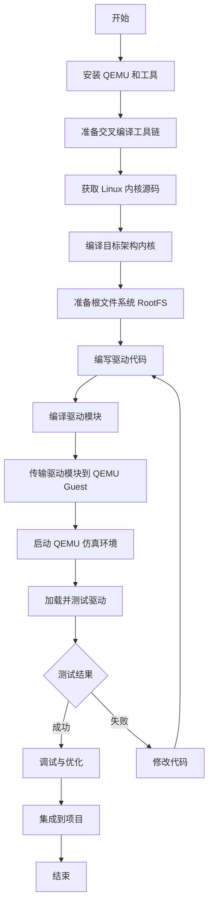

---
tags:
  - linux驱动
创建日期: "20250409"
---

好的，从Linux应用工程师转向驱动开发是一个常见的技术成长路径。这条路需要你深入理解操作系统底层，特别是Linux内核的运作机制。以下是一个建议的学习路线规划：

# 阶段流程
**阶段一：基础巩固 (Prerequisites)**

*   **目标:** 确保C语言和Linux基础扎实。
*   **内容:**
    *   **精通C语言:** 回顾指针（函数指针、多级指针）、内存管理（`malloc`/`free`在用户态的对应概念）、位操作、结构体、联合体、预处理。驱动开发中C语言是主要工具，对其掌握程度直接影响开发效率和代码质量。
    *   **深入理解Linux基础:**
        *   **命令行:** 熟练使用`ls`, `cd`, `grep`, `find`, `awk`, `sed`等常用命令。
        *   **Shell脚本:** 能够编写简单的自动化脚本，用于编译、测试等。
        *   **文件系统:** 理解VFS、inode、dentry、文件权限等概念。
        *   **进程与线程:** 理解进程创建(`fork`/`exec`)、进程间通信（管道、信号、共享内存等）、线程同步机制（互斥锁、条件变量等）。虽然驱动在内核态，但理解用户态的对应概念有助于理解内核机制。
        *   **编译与链接:** 理解`gcc`编译过程（预处理、编译、汇编、链接）、静态库与动态库。
    *   **计算机体系结构:** 了解CPU、内存（MMU）、总线（PCI/PCIe, I2C, SPI等）、中断的基本工作原理。

**阶段二：Linux内核入门 (Kernel Fundamentals)**

*   **目标:** 熟悉Linux内核环境和基本开发流程。
*   **内容:**
    *   **内核架构:** 理解用户空间与内核空间、系统调用接口、内核的整体结构（进程管理、内存管理、文件系统、设备驱动、网络栈）。
    *   **内核模块编程:**
        *   学习编写简单的"Hello World"内核模块。
        *   掌握模块的加载(`insmod`/`modprobe`)、卸载(`rmmod`)、查看(`lsmod`)。
        *   理解模块的初始化 (`module_init`) 和退出 (`module_exit`) 函数。
        *   学习`EXPORT_SYMBOL`导出符号供其他模块使用。
    *   **内核编译与配置:**
        *   学习如何获取内核源码、配置内核选项（`menuconfig`/`xconfig`）、编译内核和模块。
        *   理解`Kconfig`和`[[Makefile]]`在内核中的作用。
    *   **内核调试基础:**
        *   掌握最基础的`printk`打印调试。
        *   了解`dmesg`查看内核日志。
        *   （可选）初步了解`kgdb`、`ftrace`等更强大的调试工具。

**阶段三：核心驱动概念 (Core Driver Concepts)**

*   **目标:** 掌握驱动开发的核心技术点。
*   **内容:**
    *   **字符设备驱动:**
        *   理解`file_operations`结构体及其常用成员（`open`, `read`, `write`, `ioctl`, `release`等）。
        *   学习设备号（主次设备号）、设备文件的创建（`mknod`）和驱动注册/注销流程 (`register_chrdev_region`, `cdev_init`, `cdev_add`, `cdev_del`, `unregister_chrdev_region`)。
        *   实现一个简单的字符设备驱动（如虚拟的`/dev/null`或`/dev/zero`类似功能的设备）。
    *   **并发与同步:**
        *   理解内核并发的来源（多核、中断、抢占）。
        *   学习内核提供的同步机制：原子操作、自旋锁 (`spinlock`)、互斥锁 (`mutex`)、信号量 (`semaphore`)、读写锁 (`rwlock`)，并理解它们的使用场景和区别。
    *   **内核内存管理:**
        *   学习内核内存分配函数：`kmalloc`/`kzalloc` (基于slab分配器，用于小块连续物理内存)、`vmalloc` (用于大块虚拟连续内存)。
        *   理解用户空间与内核空间数据拷贝：`copy_to_user`/`copy_from_user`。
        *   （可选）了解页分配器、slab分配器原理。
    *   **中断处理:**
        *   理解中断的概念和流程。
        *   学习请求和释放中断：`request_irq`/`free_irq`。
        *   理解中断上半部（Top Half）和下半部（Bottom Half）的区别和必要性。
        *   学习实现下半部的机制：Tasklet、Workqueue。
    *   **时间与延迟:**
        *   内核定时器 (`timer_list`)。
        *   延迟函数 (`msleep`, `udelay`, `mdelay`)。
        *   Jiffies 和 HZ。
    *   **硬件访问:**
        *   理解I/O端口和I/O内存的区别。
        *   学习访问I/O内存：`ioremap`/`iounmap`，以及读写函数 (`readb`/`readw`/`readl`, `writeb`/`writew`/`writel`)。
        *   （可选，较旧架构）学习访问I/O端口：`request_region`/`release_region`, `inb`/`outb`等。

**阶段四：常用总线与设备驱动模型 (Common Subsystems & Device Model)**

*   **目标:** 学习主流总线驱动的编写方式和Linux设备模型。
*   **内容:**
    *   **Linux设备模型:**
        *   理解`kobject`, `kset`, `sysfs`的基本概念和关系。
        *   了解设备模型如何组织设备、驱动和总线。
    *   **平台设备驱动 (Platform Device):**
        *   学习针对嵌入式系统中最常用的“无标准总线”设备（如SOC内部集成的控制器）的驱动模型。
        *   理解`platform_device`和`platform_driver`的注册和匹配过程。
    *   **设备树 (Device Tree):**
        *   学习设备树的语法和作用（硬件描述、资源传递）。
        *   掌握如何在驱动中获取设备树节点信息（`of_find_node_by_path`, `of_property_read_u32`, `of_get_gpio`, `of_irq_get`等）。这是现代嵌入式Linux驱动开发的必备技能。
    *   **具体总线驱动:** (根据你的目标领域选择深入)
        *   **GPIO驱动:** 控制通用输入输出引脚，使用`gpiolib`框架。
        *   **I2C驱动:** 学习I2C协议基础，编写`i2c_driver`和`i2c_client`，使用`i2c-core`。
        *   **SPI驱动:** 学习SPI协议基础，编写`spi_driver`，使用`spi-core`。
        *   **串口 (TTY) 驱动:** 理解TTY子系统，编写UART驱动。
        *   **(可选)** USB驱动、网络驱动、块设备驱动、显示驱动 (Framebuffer/DRM) 等。

**阶段五：高级主题与实践 (Advanced Topics & Practice)**

*   **目标:** 深入理解内核机制，提升驱动开发能力。
*   **内容:**
    *   **电源管理:** 了解内核电源管理框架（`suspend`/`resume`, Runtime PM）。
    *   **DMA (Direct Memory Access):** 理解DMA原理，学习使用内核DMA API，提高数据传输效率。
    *   **高级调试:** 熟练使用`ftrace`, `perf`, `SystemTap`等工具进行性能分析和问题定位。
    *   **实时Linux (PREEMPT_RT):** 如果你的电源设备有高实时性要求，需要了解实时补丁的原理和应用。
    *   **阅读内核源码:** 这是提升最快的方式。选择一个你感兴趣或工作中涉及的子系统，深入阅读其驱动代码。
    *   **动手实践:**
        *   在开发板（如Raspberry Pi, BeagleBone等）上实践编写和调试驱动。
        *   尝试修改现有驱动以增加功能或修复Bug。
        *   参与开源社区，尝试提交简单的补丁。

**推荐资源:**

*   **书籍:**
    *   《Linux Device Drivers, Third Edition》(LDD3) - 经典入门，虽然有些内容稍旧，但核心概念依然适用。
    *   《Essential Linux Device Drivers》 - 内容更新，覆盖更广。
    *   《Understanding the Linux Kernel》 - 深入理解内核原理。
*   **在线资源:**
    *   Linux内核文档 (`Documentation/` 目录下的文档) - 最权威的资料。
    *   LWN.net - 跟踪内核开发动态和深入技术文章。
    *   Bootlin (Free Electrons) 的培训材料 - 质量很高，包含设备树、驱动开发等。
    *   内核邮件列表 - 查看特定子系统的讨论。

**学习建议:**

*   **理论与实践结合:** 不要只看书，一定要动手编写、编译、加载、测试驱动代码。
*   **循序渐进:** 从简单模块开始，逐步增加复杂度。
*   **多读源码:** 阅读优秀驱动代码是最好的学习方式之一。
*   **善用调试工具:** `printk`是基础，但要学会使用更高级的工具。
*   **保持耐心:** 驱动开发涉及底层细节，遇到问题很正常，需要耐心分析和解决。

作为电源设备SOC开发，你可能需要特别关注 **平台设备驱动、设备树、I2C/SPI驱动、GPIO驱动、中断处理、内核定时器以及可能的实时性要求（PREEMPT_RT）和电源管理**。祝你学习顺利！


---
# QEMU 开发

好的，结合[[QEMU]]进行Linux驱动的快速开发验证是一个非常高效的方法，尤其是在硬件资源有限或者需要频繁迭代的早期开发阶段。它能帮你摆脱对物理硬件的强依赖，加速编译-部署-测试循环。

以下是如何利用QEMU进行驱动开发验证的步骤和要点：

**1. 搭建QEMU仿真环境**

*   **安装QEMU:**
    在你的Linux开发主机上安装QEMU。你需要针对目标架构的QEMU包，例如，如果你的目标是ARM架构，你可能需要 `qemu-system-arm` 或 `qemu-system-aarch64`。
    ```bash
    # 例如在 Ubuntu/Debian 上
    sudo apt update
    sudo apt install qemu-system-arm qemu-utils
    # 或者针对 aarch64
    # sudo apt install qemu-system-aarch64 qemu-utils
    ```
*   **准备交叉编译工具链:**
    你需要一个能在你的开发主机（通常是x86）上编译出目标架构（如ARM）可执行代码的工具链。
    ```bash
    # 例如在 Ubuntu/Debian 上安装 ARM 32-bit 工具链
    sudo apt install gcc-arm-linux-gnueabihf g++-arm-linux-gnueabihf
    # 或者 ARM 64-bit 工具链
    # sudo apt install gcc-aarch64-linux-gnu g++-aarch64-linux-gnu
    ```
*   **获取Linux内核源码:**
    下载与你目标设备或QEMU仿真环境兼容的Linux内核源码。最好使用目标硬件正在使用的或者计划使用的内核版本，或者一个稳定的LTS版本。
*   **编译目标架构的Linux内核:**
    *   **配置内核:** 针对QEMU支持的虚拟开发板进行配置。对于ARM/AArch64，`virt` machine通常是最佳选择。你需要启用内核模块支持 (`CONFIG_MODULES=y`) 以及你驱动所依赖的任何子系统（例如I2C, SPI, GPIO等，即使是QEMU虚拟的）。为了调试方便，强烈建议开启调试选项 (`CONFIG_DEBUG_INFO=y`, `CONFIG_GDB_SCRIPTS=y`, `CONFIG_KGDB=y`, `CONFIG_KGDB_SERIAL_CONSOLE=y` 等)。
    * [[vexpress_defconfig]]
        ```bash
        # 切换到内核源码目录
        cd linux-source
        # 配置 (以ARM为例)
        export ARCH=arm
        export CROSS_COMPILE=arm-linux-gnueabihf-
        make virt_defconfig # 使用虚拟开发板的默认配置，根据不同的厂商选择
        make menuconfig     # 进入菜单进行详细配置，确保开启上述选项
        # 编译内核镜像和设备树 (DTB)
        make -j$(nproc) zImage modules dtbs //使用和这个配置报错了
        # 硬浮点ARM（大多数现代ARM设备）
			make ARCH=arm CROSS_COMPILE=arm-linux-gnueabihf- -j$(nproc) zImage modules dtbs

		 # 或软浮点ARM（一些较老的嵌入式设备）
make ARCH=arm CROSS_COMPILE=arm-linux-gnueabi- -j$(nproc) zImage modules dtbs
        ```
    *   **编译内核模块:** 虽然上一步的 `make modules` 会编译内核自带的模块，但主要是为了设置好模块编译环境。
*   **准备根文件系统 (RootFS):**
    你需要一个包含基本Linux用户空间工具（如`busybox`、C库、`insmod`/`rmmod`等）的目标架构根文件系统。可以通过以下方式获取或构建：
    *   **Buildroot/Yocto:** 这是最灵活和推荐的方式，可以定制一个最小化的文件系统。
    *   **发行版提供的镜像:** 如Debian/Ubuntu为ARM提供的预构建镜像。
    *   **现成的QEMU镜像:** 网络上可以找到一些预先为QEMU准备好的包含内核和根文件系统的镜像。
	在claude生成的[[linux驱动开发（claude）]]流程中，似乎没有提及准备根文件系统的这个概念
    你需要将编译好的内核模块（位于内核源码树的对应目录）复制到这个根文件系统的 `/lib/modules/<kernel_version>/` 目录下。

**2. 开发与测试流程**

*   **编写驱动代码:** 在你的开发主机上编写你的驱动代码 (`my_driver.c`)。
*   **编译驱动模块:** 使用内核的构建系统来编译你的外部模块。在你的驱动代码目录下创建一个简单的`Makefile`:
    ```makefile
    obj-m += my_driver.o

    all:
        make -C /path/to/your/linux-source M=$(PWD) modules

    clean:
        make -C /path/to/your/linux-source M=$(PWD) clean
    ```
    然后执行编译（确保`ARCH`和`CROSS_COMPILE`环境变量已设置）：
    ```bash
    export ARCH=arm
    export CROSS_COMPILE=arm-linux-gnueabihf-
    make
    ```
    这会在当前目录下生成 `my_driver.ko` 文件。
*   **将驱动模块传输到QEMU Guest:**
    有多种方法可以将 `my_driver.ko` 放到运行QEMU的Linux Guest系统中：
    *   **集成到RootFS镜像:** 在启动QEMU前，将 `.ko` 文件直接拷贝到根文件系统镜像的某个目录（如 `/home/root` 或 `/opt`）。这需要你能够挂载并修改RootFS镜像（如 `losetup`, `mount`）。
    *   **网络传输 (SCP/SFTP):** 如果你在QEMU中配置了网络（例如使用 `user` 网络模式或 `tap` 设备），并且Guest系统运行了`sshd`服务，你可以通过`scp`将模块复制进去。
    *   **QEMU共享文件夹 (VirtFS / 9P):** 这是最方便的持续开发方式。启动QEMU时添加类似参数：
        ```bash
        qemu-system-arm ... \
          -fsdev local,id=shared_dev,path=/path/on/host/to/share,security_model=passthrough \
          -device virtio-9p-pci,fsdev=shared_dev,mount_tag=host_share
        ```
        然后在Guest系统内挂载：
        ```bash
        mkdir /mnt/host
        mount -t 9p -o trans=virtio host_share /mnt/host
        ```
        之后你就可以直接在Host上修改编译，在Guest的`/mnt/host`下就能看到最新的`.ko`文件。
*   **启动QEMU:**
    使用类似如下命令启动QEMU（以ARM `virt` machine为例）：
    ```bash
    qemu-system-arm \
      -M virt \
      -cpu cortex-a15 \
      -m 1024M \
      -kernel /path/to/your/linux-source/arch/arm/boot/zImage \
      -append "root=/dev/vda console=ttyAMA0" \
      -drive file=/path/to/your/rootfs.ext4,format=raw,id=hd0,if=none \
      -device virtio-blk-device,drive=hd0 \
      -netdev user,id=net0 \
      -device virtio-net-device,netdev=net0 \
      -dtb /path/to/your/linux-source/arch/arm/boot/dts/vexpress-v2p-ca15-tc1.dtb # 注意选择匹配的dtb
      -nographic \
      # 如果使用共享文件夹，添加上面提到的 -fsdev 和 -device 参数
      # 如果要进行GDB调试，添加 -s -S
      # -s  # GDB server on tcp::1234
      # -S  # Freeze CPU at startup (wait for GDB)
    ```
*   **在QEMU Guest中加载和测试:**
    *   登录到QEMU Guest系统。
    *   使用 `insmod /path/to/my_driver.ko` 加载你的驱动。
    *   检查 `dmesg` 输出，看是否有你的驱动打印的初始化信息或错误。
    *   如果驱动创建了设备节点（如 `/dev/mydevice`），尝试对其进行操作（`cat`, `echo`, 或使用专门的测试程序）。
    *   使用 `rmmod my_driver` 卸载驱动，检查 `dmesg` 看是否有清理信息。
*   **迭代:**
    在主机上修改代码 -> 编译 -> (如果是共享文件夹则无需传输) -> 在Guest中 `rmmod` -> `insmod` -> 测试。这个循环非常快。

**3. 使用GDB进行内核调试**

QEMU对GDB调试支持非常好：

*   **启动QEMU:** 在`qemu-system-*`命令中加入 `-s` (监听TCP端口1234) 和 `-S` (启动时暂停)。
*   **启动GDB:** 在主机上，启动对应架构的GDB，并加载带调试信息的内核文件 (`vmlinux`，位于内核源码根目录，**不是**压缩后的`zImage`或`Image`)。
    ```bash
    arm-linux-gnueabihf-gdb /path/to/your/linux-source/vmlinux
    ```
*   **连接GDB:** 在GDB中连接到QEMU。
    ```gdb
    (gdb) target remote :1234
    ```
*   **加载模块符号:** 内核启动后，当你的模块被加载时，你需要告诉GDB模块代码和数据段的加载地址。这通常可以通过读取Guest系统中的 `/sys/module/my_driver/sections/` 下的地址信息，然后在GDB中使用 `add-symbol-file` 命令：
    ```gdb
    (gdb) add-symbol-file /path/on/host/to/my_driver.ko <text_addr> -s .bss <bss_addr> -s .data <data_addr>
    ```
    如果内核配置了`CONFIG_GDB_SCRIPTS=y`，可以使用内核源码中提供的Python脚本简化这个过程 (`lx-symbols` 命令)。
*   **设置断点和调试:** 现在你可以像调试普通程序一样设置断点 (`b my_driver_init`)、单步执行 (`n`, `s`)、查看变量 (`p var`)、查看内存 (`x`) 等。

**优势:**

*   **快速迭代:** 免去了烧写硬件、重启硬件的时间，编译后几乎立刻可以在模拟环境中加载测试。
*   **早期Bug发现:** 可以在没有物理硬件或硬件尚未就绪时就开始驱动逻辑的开发和调试。
*   **强大调试能力:** GDB内核调试比硬件调试器（如JTAG）在某些场景下更方便（例如，无需额外硬件连接，易于脚本化）。
*   **环境隔离:** 不会影响开发主机或其他物理设备。

**局限性:**

*   **硬件保真度:** QEMU模拟的硬件可能与真实硬件存在差异，特别是中断时序、特殊外设的精确行为。对于非常依赖硬件特性的驱动，QEMU可能无法完全模拟。
*   **外设支持:** QEMU只模拟了部分常见外设。如果你的驱动依赖于特定SOC的高度定制外设，QEMU可能无法提供支持，除非你自己为QEMU编写该外设的模型（非常复杂）。
*   **性能:** QEMU是模拟执行，性能远低于真实硬件，不适合进行性能敏感型驱动的精确测试。

**结论:**

QEMU是Linux驱动开发的利器，尤其适合 **逻辑验证、框架搭建、早期调试和快速迭代**。对于涉及标准接口（如字符设备、平台设备模型、I2C/SPI等）的驱动开发，它能极大提高效率。但最终的 **硬件相关性测试、性能测试和系统集成测试** 仍必须在目标物理硬件上完成。

---
# windows 开发配置

在Windows上进行Linux驱动开发，核心思路是在Windows系统上搭建一个Linux开发环境。直接在Windows上编译Linux内核模块是不可行的，因为驱动开发深度依赖Linux内核的头文件、构建系统和运行时环境。

以下是在Windows上进行Linux驱动开发的几种主流方案：

**方案一：使用虚拟机 (Virtual Machine - VM)**

这是最传统且功能最完善的方法。你在Windows上安装虚拟机软件，然后在虚拟机里运行一个完整的Linux发行版（如Ubuntu, Debian, Fedora等）。

1.  **选择虚拟机软件:**
    *   **VirtualBox:** 免费且开源，功能强大，易于使用，是个人开发者的常用选择。
    *   **VMware Workstation Player:** 免费供个人使用，性能通常较好，功能也很全面。VMware Workstation Pro是付费版本，功能更多。
    *   **Hyper-V:** Windows自带的虚拟化解决方案（通常在Pro或Enterprise版Windows中提供）。性能不错，但与VirtualBox/VMware可能存在一些兼容性问题（例如，不能同时运行）。

2.  **安装Linux发行版:**
    *   下载一个你熟悉的Linux发行版的ISO镜像文件（推荐Ubuntu LTS版本，社区支持好，资料多）。
    *   在虚拟机软件中创建新的虚拟机，配置CPU核心数、内存大小（建议至少4GB内存给虚拟机）、硬盘空间。
    *   使用下载的ISO文件安装Linux操作系统到虚拟机中。

3.  **配置Linux开发环境 (在虚拟机内部):**
    *   安装必要的编译工具：`sudo apt update && sudo apt install build-essential gcc make`
    *   安装交叉编译工具链（如果你的目标硬件不是x86）：例如ARM `sudo apt install gcc-arm-linux-gnueabihf g++-arm-linux-gnueabihf` 或 AArch64 `sudo apt install gcc-aarch64-linux-gnu g++-aarch64-linux-gnu`
    *   获取Linux内核源码：`git clone` 或下载源码压缩包。
    *   安装QEMU（用于仿真测试）：`sudo apt install qemu-system-arm qemu-utils` （根据目标架构选择）
    *   配置网络、安装其他必要的库或工具。

4.  **代码开发与文件共享:**
    *   **选项A (推荐): 使用VS Code Remote - SSH:** 在Windows上安装VS Code，并安装"Remote - SSH"扩展。通过SSH连接到你的Linux虚拟机。这样你可以在Windows上使用VS Code编辑代码，但代码的编译、运行、调试都在远程的Linux虚拟机上进行，体验非常流畅。
    *   **选项B: 共享文件夹:** 设置虚拟机软件的共享文件夹功能，将Windows上的一个目录映射到Linux虚拟机内部。你可以在Windows上编辑代码，然后在虚拟机终端中访问该目录进行编译。注意文件权限和换行符问题。
    *   **选项C: Samba/NFS:** 在Linux虚拟机中配置Samba或NFS服务，然后在Windows中映射网络驱动器。

5.  **开发流程:**
    *   在Windows上使用IDE (如VS Code) 编辑代码（通过SSH或共享文件夹访问）。
    *   在Linux虚拟机的终端中，进入代码目录，设置好交叉编译环境变量 (`ARCH`, `CROSS_COMPILE`)。
    *   使用`make`命令编译驱动模块 (`.ko`文件)。
    *   使用QEMU启动一个模拟的目标环境（需要准备内核镜像和根文件系统），并将编译好的`.ko`文件传入QEMU环境中。
    *   在QEMU环境中使用`insmod`加载驱动，`dmesg`查看日志，进行测试。

**方案二：使用Windows Subsystem for Linux 2 (WSL 2)**

WSL 2在Windows 10/11上提供了一个更轻量级、集成度更高的Linux环境。它运行一个真实的Linux内核，因此非常适合编译和运行Linux程序，包括QEMU。

1.  **安装WSL 2:**
    *   确保你的Windows版本支持WSL 2。
    *   以管理员身份打开PowerShell或CMD，运行：`wsl --install`。这会自动启用所需功能并安装默认的Ubuntu发行版。（你也可以选择安装其他发行版，如 `wsl --install -d Debian`）。
    *   首次启动会提示设置用户名和密码。

2.  **配置WSL 2 Linux环境:**
    *   打开安装好的Linux发行版（例如，在开始菜单搜索Ubuntu）。
    *   在WSL 2的Linux环境中，执行与虚拟机方案中第3步类似的操作：安装编译工具、交叉编译工具链、获取内核源码、安装QEMU等。
    *   ```bash
        sudo apt update
        sudo apt install build-essential gcc make git
        # 安装交叉编译器 (示例)
        sudo apt install gcc-arm-linux-gnueabihf
        # 安装QEMU (示例)
        sudo apt install qemu-system-arm qemu-utils
        # 克隆内核源码
        git clone <kernel_repo_url>
        ```

3.  **代码开发与文件访问:**
    *   **选项A (极力推荐): 使用VS Code Remote - WSL:** 在Windows上安装VS Code，并安装"Remote - WSL"扩展。打开VS Code，它会自动检测到WSL环境。你可以直接打开位于WSL文件系统中的项目文件夹 (`\\wsl$\Ubuntu\home\<user>\...`)，获得近乎原生的开发体验。代码编辑在Windows端，编译、运行、调试在WSL端无缝进行。
    *   **选项B: 直接访问Windows文件:** WSL 2可以访问Windows的文件系统，挂载点通常在 `/mnt/c`, `/mnt/d` 等。你可以在Windows上存放代码，然后在WSL终端中进入 `/mnt/c/...` 目录进行编译。但为了避免潜在的权限和性能问题，推荐将项目代码放在WSL 2的Linux文件系统内（例如`~/projects`）。

4.  **开发流程:**
    *   在Windows上使用VS Code (通过Remote - WSL扩展) 编辑位于WSL文件系统内的代码。
    *   打开VS Code的集成终端（这会自动打开WSL的bash）。
    *   在终端中设置交叉编译环境变量，使用`make`编译驱动。
    *   在WSL 2环境中启动QEMU进行仿真测试，加载`.ko`文件。
        *   注意：在WSL 2中运行QEMU，特别是需要图形界面的QEMU，可能需要额外配置（如安装Windows上的X Server，如VcXsrv或使用WSLg新特性）。对于无图形界面的驱动测试 (`-nographic`) 通常没有问题。

**对比与选择:**

*   **VM:**
    *   **优点:** 最成熟稳定，隔离性最好，硬件模拟更全面（理论上），与传统嵌入式开发流程一致。
    *   **缺点:** 资源占用相对较高（内存、磁盘），文件在Host/Guest间共享配置稍繁琐（除非用SSH）。
*   **WSL 2:**
    *   **优点:** 资源占用相对较低，与Windows集成度高（特别是文件访问和VS Code），启动速度快。
    *   **缺点:** 是较新的技术，某些边缘情况或特定硬件/网络访问可能有限制，图形应用支持需要额外配置或依赖较新Windows版本。

**通用工具:**

*   **IDE:** Visual Studio Code (VS Code) 配合 Remote Development 扩展包（Remote - SSH 或 Remote - WSL）是目前Windows上进行Linux开发（包括驱动）的最佳选择。
*   **版本控制:** Git for Windows。你可以在Windows上管理仓库，并通过VS Code或共享方式让Linux环境访问。
*   **终端:** Windows Terminal 是一个不错的选择，可以方便地管理PowerShell, CMD以及WSL的多个终端标签页。

**总结:**

对于在Windows上进行Linux驱动开发：

1.  **必须** 搭建一个Linux环境（VM或WSL 2）。
2.  **强烈推荐** 使用VS Code配合Remote Development扩展（SSH或WSL）进行代码编辑。
3.  **编译、链接、运行QEMU仿真** 等核心步骤都在你搭建的Linux环境（VM或WSL 2）中完成。

选择VM还是WSL 2取决于你的具体需求、硬件资源和个人偏好。对于追求更好集成度和较低资源占用的用户，WSL 2是很好的选择。如果需要最佳的隔离性、稳定性或使用特定VMware/VirtualBox高级特性，VM仍然是可靠的方案。


# 流程图

好的，根据您提供的笔记 [[linux设备驱动程序开发路线（cursor）]] 中的内容，我将为您生成一个关于使用 QEMU 进行 Linux 驱动开发的 Mermaid 流程图。流程图将重点展示 QEMU 仿真环境搭建、驱动开发与测试的关键步骤。



### 解释：
- **安装 QEMU 和工具**：在开发主机上安装 QEMU（如 `qemu-system-arm`）及相关工具。
- **准备交叉编译工具链**：安装适用于目标架构的工具链（如 ARM 的 `gcc-arm-linux-gnueabihf`）。
- **获取 Linux 内核源码**：下载与目标设备或 QEMU 兼容的内核源码。
- **编译目标架构内核**：配置并编译内核镜像和设备树（DTB），启用模块支持和调试选项。
- **准备根文件系统 RootFS**：构建或获取包含基本工具的目标架构文件系统，并将内核模块复制到其中。
- **编写驱动代码**：在主机上编写驱动代码（如 `my_driver.c`）。
- **编译驱动模块**：使用内核构建系统编译驱动，生成 `.ko` 文件。
- **传输驱动模块到 QEMU Guest**：通过集成到 RootFS、网络传输或共享文件夹（如 VirtFS/9P）将模块传入 QEMU 虚拟机。
- **启动 QEMU 仿真环境**：使用编译好的内核、RootFS 和设备树启动 QEMU（如 ARM `virt` machine）。
- **加载并测试驱动**：在 QEMU Guest 中使用 `insmod` 加载驱动，检查 `dmesg` 日志并测试设备节点。
- **调试与优化**：根据测试结果使用 GDB 等工具调试代码。
- **集成到项目**：将验证通过的驱动应用到实际项目中。

### 使用方法：
1. 在您的 Obsidian 笔记中，创建一个新的代码块（使用 ``` 符号）。
2. 将上述代码复制粘贴到代码块中，并确保第一行是 ```mermaid。
3. 保存笔记，Obsidian 会自动渲染出流程图（前提是 Mermaid 支持已启用）。

如果您希望流程图包含更多具体细节（例如 GDB 调试步骤或特定架构配置），或者需要调整某些步骤，请告诉我，我会进一步完善流程图。
