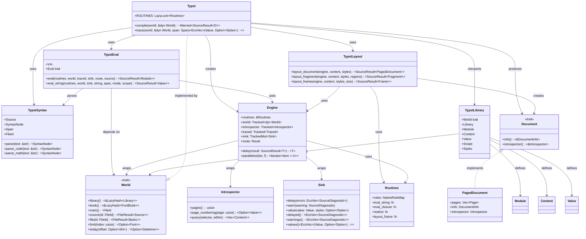

  学习工具类

  1. https://github.com/rust-lang/rustlings - 46.9K⭐
    - 官方Rust练习项目，通过修复小错误学习Rust
    - 新手必做，与官方书籍配合学习
  2. https://github.com/rust-unofficial/awesome-rust - 52.9K⭐
    - Rust资源大全，包含各种库、工具、教程
    - 发现更多优质项目的宝库

  开发工具类

  3. https://github.com/sharkdp/bat - 47.8K⭐
    - cat命令的增强版，支持语法高亮和Git集成
    - 代码简洁，学习CLI工具开发的绝佳例子
  4. https://github.com/sharkdp/fd - 32.6K⭐
    - find命令的现代化替代品，速度快且易用
    - 文件系统操作的经典实现
  5. https://github.com/BurntSushi/ripgrep - 47.4K⭐
    - 超快的文本搜索工具，递归搜索目录
    - 性能优化的典范
  6. https://github.com/starship/starship - 42.1K⭐
    - 跨平台提示符，速度快、可定制
    - Shell集成和配置管理的经典案例

  终端应用类

  7. https://github.com/alacritty/alacritty - 60.4K⭐
    - 高性能跨平台终端模拟器
    - OpenGL渲染，系统编程的绝佳范例
  8. https://github.com/helix-editor/helix - 32.9K⭐
    - 模态文本编辑器，类似Vim
    - 文本编辑器架构的典型实现

  应用框架类

  9. https://github.com/tauri-apps/tauri - 96.9K⭐
    - 构建轻量级桌面应用的框架
    - Web技术+Rust后端的完美结合
  10. https://github.com/bevyengine/bevy - 34.8K⭐
    - 数据驱动的游戏引擎
    - ECS架构和游戏开发的经典实现

  实用工具类

  11. https://github.com/rustdesk/rustdesk - 98.9K⭐
    - 开源远程桌面软件
    - 网络编程和GUI开发的综合项目
  12. https://github.com/dani-garcia/vaultwarden - 34.7K⭐
    - Bitwarden服务器的兼容实现
    - Web服务和数据库操作的实践

  🎯 新手学习路径建议

  第一阶段：基础练习

  1. 先完成 rustlings 练习
  2. 研读 bat 或 fd 的源码（相对简单）
  3. 尝试理解 ripgrep 的性能优化技巧

  第二阶段：深入学习

  4. 分析 starship 的配置系统和插件架构
  5. 学习 tauri 如何结合Web技术
  6. 研究 bevy 的ECS架构设计

  第三阶段：实战项目

  7. 参考 rustdesk 的网络编程
  8. 学习 vaultwarden 的Web服务实现

  💡 学习建议

  - 从工具类开始：bat、fd这类项目代码量适中，逻辑清晰
  - 注重代码质量：这些项目都有很好的代码规范和测试
  - 关注性能优化：Rust项目往往注重性能，学习优化技巧
  - 理解架构设计：特别是大型项目的模块化和依赖管理

  这些项目都是Rust生态的经典之作，不仅star数高，而且代码质量优秀，非常适合新手学习和参考！

# Typst UML软件架构类图

  

## 概述

此UML类图展示了Typst编译器的核心软件架构，包括主要crate、trait、struct及其相互关系。

  

## UML类图 (Mermaid)

  

  

## 核心组件说明

  

### 主要Crates

- **Typst**: 主入口，提供编译接口和常用函数

- **TypstSyntax**: 负责源码解析，生成语法树

- **TypstEval**: 求值器，执行Typst代码

- **TypstLayout**: 布局引擎，将内容渲染为帧

- **TypstLibrary**: 标准库和核心数据结构

  

### 核心Traits

- **World**: 系统依赖的抽象接口，提供文件系统、字体等

- **Document**: 输出文档的统一接口

- **Eval**: 求值器trait定义

  

### 关键数据结构

- **Engine**: 编译引擎，包装所有编译上下文

- **Introspector**: 内省器，用于解决循环依赖

- **Sink**: 错误和警告收集器

- **Routines**: 原生函数注册表

  

## 架构特点

  

1. **模块化设计**: 每个crate职责单一，边界清晰

2. **trait抽象**: 通过trait实现多态和可扩展性

3. **依赖注入**: Engine作为上下文对象管理依赖

4. **错误处理**: 统一的错误收集和报告机制

5. **增量编译**: 通过comemo框架实现高效缓存

  

## 依赖关系

  

- 解析→求值→布局→导出的清晰数据流

- 各阶段通过Engine和World接口解耦

- Introspector实现布局阶段的自引用解析