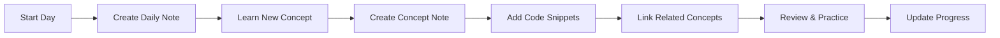

<div align="center">

# 🦀 Rust Learning Vault

**A comprehensive Rust learning knowledge base built with Obsidian**

[](https://github.com/Desperado1001/rust-learning-vault/stargazers)
[](https://github.com/Desperado1001/rust-learning-vault/network/members)
[](LICENSE)
[](https://obsidian.md/)
[](https://www.rust-lang.org/)

[🚀 Quick Start](#-quick-start) • [📚 Documentation](#-vault-structure) • [🎯 Features](#-core-features) • [🤝 Contributing](#-contributing)

</div>

---

## 📖 About This Project

This is a **Knowledge Accumulation Workflow (KAW)** system built in Obsidian, designed to help you systematically learn and master the Rust programming language. It combines the power of bidirectional linking, atomic notes, and visual knowledge graphs.

### ✨ Why This Vault?

- ✅ **Structured Learning Path** - From zero to hero with clear roadmaps
- ✅ **Interconnected Knowledge** - Build a web of concepts with bidirectional links
- ✅ **Progress Tracking** - Monitor your learning journey
- ✅ **Code Snippet Library** - Reusable examples at your fingertips
- ✅ **Problem Solving** - Document challenges and solutions
- ✅ **Review System** - Spaced repetition for long-term retention
- ✅ **WebAssembly Focus** - Special resources for Rust + WASM development

---

## 🚀 Quick Start

### Prerequisites

- **Obsidian** - [Download here](https://obsidian.md/) (Free)
- **Rust** (optional) - [Install Rust](https://www.rust-lang.org/tools/install)

### Installation

```bash
# Clone this repository
git clone https://github.com/Desperado1001/rust-learning-vault.git

# Open in Obsidian
# 1. Launch Obsidian
# 2. Click "Open folder as vault"
# 3. Select the cloned rust_vault folder
```

### 🎯 Start Here

Once opened in Obsidian, navigate to:

1. **`00-Index/Rust-MOC.md`** - 📍 Your starting point (Master Index)
2. **`00-Index/Learning-Roadmap.md`** - 🗺️ Complete learning path
3. **`00-Index/Setup-Guide.md`** - ⚙️ Development environment setup

---

## 📂 Vault Structure

```
rust_vault/
│
├── 📍 00-Index/                   # Start Here!
│   ├── Rust-MOC.md                # 🌟 Master Map of Content
│   ├── Learning-Roadmap.md        # Complete learning pathway
│   ├── Setup-Guide.md             # Environment setup
│   └── How-To-Use-This-Vault.md   # Usage guide
│
├── 📘 01-Fundamentals/            # Core Concepts
│   ├── Ownership.md               # Memory management
│   ├── Borrowing.md               # References & borrowing
│   ├── Lifetimes.md               # Lifetime annotations
│   └── ...
│
├── 🎓 02-Advanced-Concepts/       # Advanced Topics
│   ├── Traits.md                  # Trait system
│   ├── Generics.md                # Generic programming
│   ├── Macros.md                  # Macro system
│   └── ...
│
├── 📦 03-Standard-Library/        # Std Library Reference
│   ├── Collections/
│   ├── Iterators/
│   └── ...
│
├── 🌐 04-Ecosystem/               # Crates & Tools
│   ├── Cargo.md                   # Package manager
│   ├── Crates/
│   │   ├── Serde.md
│   │   ├── Tokio.md
│   │   └── ...
│   └── ...
│
├── 🎨 05-Patterns-and-Practices/  # Best Practices
│   ├── Design-Patterns/
│   ├── Error-Handling/
│   └── ...
│
├── 🚀 06-Projects/                # Hands-on Projects
│   ├── Rust-Web-Projects.md       # Web development guide
│   ├── Rust-WebAssembly-Guide.md  # WASM comprehensive guide
│   ├── WASM-Quick-Reference.md    # WASM quick reference
│   └── ...
│
├── 💾 07-Code-Snippets/           # Reusable Code
│   └── (Your code examples)
│
├── 📅 08-Daily-Learning/          # Learning Journal
│   └── (Daily notes)
│
├── ❓ 09-Questions-and-Answers/   # Problem Solving
│   └── (Q&A documentation)
│
└── 📝 10-Templates/               # Note Templates
    ├── Concept-Template.md
    ├── Daily-Learning-Template.md
    └── Code-Snippet-Template.md
```

---

## 🎯 Core Features

### 1. 🔗 Bidirectional Linking

Create a knowledge web with `[[double brackets]]`:

```markdown
Understanding [[Ownership]] requires knowledge of [[Borrowing]] and [[Lifetimes]].
```

### 2. 🏷️ Smart Tagging System

Organize with multi-dimensional tags:

```markdown
#rust #concept #ownership #fundamental #learning
```

### 3. 📊 Visual Knowledge Graph

- Press `Ctrl/Cmd + G` to see your knowledge network
- Identify knowledge gaps and connections
- Track learning progress visually

### 4. 📋 Template System

Quick-start notes with pre-built templates:
- **Concept Template** - For learning new concepts
- **Daily Learning Template** - Daily progress tracking
- **Code Snippet Template** - Reusable code examples

### 5. 🔍 Powerful Search

- `Ctrl/Cmd + Shift + F` - Global search
- `tag:#rust` - Search by tags
- `path:06-Projects` - Search in specific folders

---

## 💡 Workflow

### Daily Learning Process



### Step-by-Step

1. **📅 Morning** - Create daily note using template
2. **📖 Study** - Learn from resources, create concept notes
3. **💻 Practice** - Code along, save useful snippets
4. **🔗 Connect** - Link new concepts to existing knowledge
5. **❓ Document** - Record questions and solutions
6. **📊 Review** - Check graph view, identify weak areas
7. **🌙 Evening** - Update daily note with progress

---

## 🔌 Recommended Plugins

### Core Plugins (Built-in)

- ✅ **Daily Notes** - Automatic daily note creation
- ✅ **Templates** - Template insertion
- ✅ **Graph View** - Visual knowledge map
- ✅ **Backlinks** - See all references

### Community Plugins (Highly Recommended)

| Plugin | Purpose | Priority |
|--------|---------|----------|
| **Calendar** | Visual calendar for daily notes | ⭐⭐⭐ |
| **Dataview** | Query and display data dynamically | ⭐⭐⭐ |
| **Templater** | Advanced template features | ⭐⭐⭐ |
| **Tasks** | Task management with advanced queries | ⭐⭐ |
| **Kanban** | Kanban board for project tracking | ⭐⭐ |
| **Excalidraw** | Draw diagrams and sketches | ⭐⭐ |

---

## 📚 Learning Resources

### Internal Resources (Included in Vault)

- 🗺️ **Learning Roadmap** - Complete learning path
- 📖 **Rust Web Projects** - 10 curated projects (5 beginner + 5 production)
- 🌐 **WebAssembly Guide** - Comprehensive WASM tutorial
- ⚡ **WASM Quick Reference** - Instant lookup guide

### External Resources

| Resource | Type | Link |
|----------|------|------|
| The Rust Book | 📖 Official Guide | [rust-book](https://doc.rust-lang.org/book/) |
| Rust by Example | 💻 Interactive | [rust-by-example](https://doc.rust-lang.org/rust-by-example/) |
| Rustlings | 🎮 Exercises | [rustlings](https://github.com/rust-lang/rustlings) |
| Rust std docs | 📚 API Reference | [std-docs](https://doc.rust-lang.org/std/) |
| Rust WASM Book | 🌐 WASM Guide | [rustwasm-book](https://rustwasm.github.io/docs/book/) |

---

## 🎨 Best Practices

### 📝 Note-Taking Tips

1. **Atomic Notes** - One concept per note
2. **Link Everything** - Connect at least 3 related concepts
3. **Use Examples** - Include code snippets
4. **Regular Reviews** - Spaced repetition: 1d, 3d, 7d, 30d

### 🏷️ Tagging Convention

```markdown
# Type Tags
#concept #snippet #project #question #resource

# Difficulty
#easy #medium #hard

# Status
#learning #understood #mastered #review

# Topic
#ownership #async #macros #wasm #web
```

### 📅 Daily Routine

- **Morning** - Review yesterday's notes
- **Midday** - Learn new concepts, practice
- **Evening** - Summarize in daily note

---

## 🔄 Backup & Sync

### Option 1: Git (Recommended)

```bash
cd rust_vault
git init
git add .
git commit -m "Daily learning update"
git push
```

### Option 2: Cloud Sync

- Obsidian Sync (Official, paid)
- Syncthing (Free, self-hosted)
- OneDrive / Dropbox / iCloud

---

## 📊 Progress Tracking

### Using Dataview (Plugin Required)

```dataview
TABLE status, difficulty, reviewed
FROM #concept
WHERE contains(file.folder, "01-Fundamentals")
SORT status DESC
```

### Manual Tracking

Maintain checklists in your MOC file.

---

## ❓ FAQ

<details>
<summary><b>I'm new to Obsidian, where do I start?</b></summary>

1. Open `00-Index/Rust-MOC.md` - Your command center
2. Read `How-To-Use-This-Vault.md` - Learn the workflow
3. Create your first daily note
4. Start learning from `Learning-Roadmap.md`

</details>

<details>
<summary><b>How do I use templates?</b></summary>

1. Create a new note
2. Type `/template` and select the desired template
3. Or manually copy from `10-Templates/`

</details>

<details>
<summary><b>Can I modify the structure?</b></summary>

Absolutely! This is YOUR vault. Adapt it to your learning style.

</details>

<details>
<summary><b>How do I contribute?</b></summary>

See [Contributing](#-contributing) section below!

</details>

---

## 🤝 Contributing

Contributions are welcome! Here's how you can help:

- ⭐ **Star this repo** - Show your support
- 🐛 **Report bugs** - Open an issue
- 💡 **Suggest improvements** - Share your ideas
- 📝 **Add resources** - Submit PRs with new content
- 🎨 **Share templates** - Create new templates

### How to Contribute

1. Fork this repository
2. Create your feature branch (`git checkout -b feature/AmazingFeature`)
3. Commit your changes (`git commit -m 'Add some AmazingFeature'`)
4. Push to the branch (`git push origin feature/AmazingFeature`)
5. Open a Pull Request

---

## 📜 License

This project is licensed under the MIT License - see the [LICENSE](LICENSE) file for details.

---

## 🙏 Acknowledgments

- [Obsidian](https://obsidian.md/) - The amazing knowledge base tool
- [Rust Community](https://www.rust-lang.org/community) - For excellent resources
- All contributors and learners using this vault

---

## 🌟 Star History

[](https://star-history.com/#Desperado1001/rust-learning-vault&Date)

---

<div align="center">

### 🚀 Ready to Start?

**[Open in Obsidian](obsidian://open?vault=rust_vault)** • **[View Learning Roadmap](00-Index/Learning-Roadmap.md)** • **[Join Discussions](https://github.com/Desperado1001/rust-learning-vault/discussions)**

---

**Made with ❤️ by [Paolo Zhao](https://github.com/Desperado1001)**

*"The Rust compiler is your friend!"* 🦀

---


**Last Updated:** January 2024 | **Version:** 2.0.0

</div>