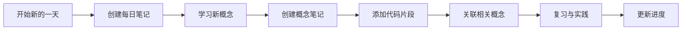

<div align="center">

# 🦀 Rust 学习知识库

**基于 Obsidian 构建的全面 Rust 学习知识管理系统**

[](https://github.com/Desperado1001/rust-learning-vault/stargazers)
[](https://github.com/Desperado1001/rust-learning-vault/network/members)
[](LICENSE)
[](https://obsidian.md/)
[](https://www.rust-lang.org/)

[🚀 快速开始](#-快速开始) • [📚 文档结构](#-vault-结构) • [🎯 核心特性](#-核心特性) • [🤝 参与贡献](#-参与贡献)

**[English](README.md)** | **简体中文**

</div>

---

## 📖 项目简介

这是一个采用**知识积累工作流（KAW）**构建的 Obsidian 知识库，旨在帮助你系统化地学习和掌握 Rust 编程语言。它结合了双向链接、原子化笔记和可视化知识图谱的强大功能。

### ✨ 为什么选择这个知识库？

- ✅ **结构化学习路径** - 从零基础到高手，清晰的学习路线图
- ✅ **知识网络互联** - 通过双向链接构建概念关联网络
- ✅ **进度可追踪** - 实时监控你的学习旅程
- ✅ **代码片段库** - 随手可得的可复用代码示例
- ✅ **问题解决方案** - 记录挑战与解决方法
- ✅ **复习系统** - 间隔重复学习，长期记忆保持
- ✅ **WebAssembly 专题** - Rust + WASM 开发特别资源

---

## 🚀 快速开始

### 前置要求

- **Obsidian** - [点击下载](https://obsidian.md/)（免费）
- **Rust** (可选) - [安装 Rust](https://www.rust-lang.org/zh-CN/tools/install)

### 安装步骤

```bash
# 克隆此仓库
git clone https://github.com/Desperado1001/rust-learning-vault.git

# 在 Obsidian 中打开
# 1. 启动 Obsidian
# 2. 点击"打开文件夹作为仓库"
# 3. 选择克隆的 rust_vault 文件夹
```

### 🎯 从这里开始

在 Obsidian 中打开后，访问以下文件：

1. **`00-Index/Rust-MOC.md`** - 📍 你的起点（主索引）
2. **`00-Index/Learning-Roadmap.md`** - 🗺️ 完整学习路径
3. **`00-Index/Setup-Guide.md`** - ⚙️ 开发环境配置

---

## 📂 Vault 结构

```
rust_vault/
│
├── 📍 00-Index/                   # 从这里开始！
│   ├── Rust-MOC.md                # 🌟 核心知识地图
│   ├── Learning-Roadmap.md        # 完整学习路径
│   ├── Setup-Guide.md             # 环境配置指南
│   └── How-To-Use-This-Vault.md   # 使用手册
│
├── 📘 01-Fundamentals/            # 基础概念
│   ├── Ownership.md               # 所有权系统
│   ├── Borrowing.md               # 引用与借用
│   ├── Lifetimes.md               # 生命周期标注
│   └── ...
│
├── 🎓 02-Advanced-Concepts/       # 进阶主题
│   ├── Traits.md                  # 特征系统
│   ├── Generics.md                # 泛型编程
│   ├── Macros.md                  # 宏系统
│   └── ...
│
├── 📦 03-Standard-Library/        # 标准库参考
│   ├── Collections/               # 集合类型
│   ├── Iterators/                 # 迭代器
│   └── ...
│
├── 🌐 04-Ecosystem/               # Crate 与工具
│   ├── Cargo.md                   # 包管理器
│   ├── Crates/
│   │   ├── Serde.md              # 序列化/反序列化
│   │   ├── Tokio.md              # 异步运行时
│   │   └── ...
│   └── ...
│
├── 🎨 05-Patterns-and-Practices/  # 最佳实践
│   ├── Design-Patterns/           # 设计模式
│   ├── Error-Handling/            # 错误处理
│   └── ...
│
├── 🚀 06-Projects/                # 实战项目
│   ├── Rust-Web-Projects.md       # Web 开发指南
│   ├── Rust-WebAssembly-Guide.md  # WASM 完整教程
│   ├── WASM-Quick-Reference.md    # WASM 速查手册
│   └── ...
│
├── 💾 07-Code-Snippets/           # 可复用代码
│   └── (你的代码示例)
│
├── 📅 08-Daily-Learning/          # 学习日志
│   └── (每日笔记)
│
├── ❓ 09-Questions-and-Answers/   # 问题解决
│   └── (Q&A 文档)
│
└── 📝 10-Templates/               # 笔记模板
    ├── Concept-Template.md        # 概念笔记模板
    ├── Daily-Learning-Template.md # 每日学习模板
    └── Code-Snippet-Template.md   # 代码片段模板
```

---

## 🎯 核心特性

### 1. 🔗 双向链接

使用 `[[双括号]]` 创建知识网络：

```markdown
理解 [[Ownership|所有权]] 需要掌握 [[Borrowing|借用]] 和 [[Lifetimes|生命周期]]。
```

### 2. 🏷️ 智能标签系统

使用多维度标签组织笔记：

```markdown
#rust #概念 #所有权 #基础 #学习中
```

### 3. 📊 可视化知识图谱

- 按 `Ctrl/Cmd + G` 查看你的知识网络
- 识别知识盲区和连接关系
- 可视化追踪学习进度

### 4. 📋 模板系统

使用预设模板快速创建笔记：
- **概念模板** - 用于学习新概念
- **每日学习模板** - 每日进度追踪
- **代码片段模板** - 可复用代码示例

### 5. 🔍 强大搜索

- `Ctrl/Cmd + Shift + F` - 全局搜索
- `tag:#rust` - 按标签搜索
- `path:06-Projects` - 在特定文件夹中搜索

---

## 💡 学习工作流

### 每日学习流程



### 详细步骤

1. **📅 早上** - 使用模板创建每日笔记
2. **📖 学习** - 从资源中学习，创建概念笔记
3. **💻 实践** - 跟随编码，保存有用的代码片段
4. **🔗 关联** - 将新概念链接到现有知识
5. **❓ 记录** - 记录问题和解决方案
6. **📊 复习** - 查看图谱视图，识别薄弱环节
7. **🌙 晚上** - 更新每日笔记，记录进度

---

## 🔌 推荐插件

### 核心插件（内置）

- ✅ **Daily Notes** - 自动创建每日笔记
- ✅ **Templates** - 模板插入
- ✅ **Graph View** - 可视化知识地图
- ✅ **Backlinks** - 查看所有引用

### 社区插件（强烈推荐）

| 插件 | 用途 | 优先级 |
|--------|---------|----------|
| **Calendar** | 每日笔记的日历视图 | ⭐⭐⭐ |
| **Dataview** | 动态查询和展示数据 | ⭐⭐⭐ |
| **Templater** | 高级模板功能 | ⭐⭐⭐ |
| **Tasks** | 高级任务管理查询 | ⭐⭐ |
| **Kanban** | 项目追踪看板 | ⭐⭐ |
| **Excalidraw** | 绘制图表和草图 | ⭐⭐ |

---

## 📚 学习资源

### 内部资源（Vault 内置）

- 🗺️ **学习路线图** - 完整学习路径
- 📖 **Rust Web 项目** - 精选 10 个项目（5 个入门 + 5 个生产级）
- 🌐 **WebAssembly 指南** - 全面的 WASM 教程
- ⚡ **WASM 速查手册** - 即时查询指南

### 外部资源

| 资源 | 类型 | 链接 |
|----------|------|------|
| Rust 程序设计语言 | 📖 官方指南 | [rust-book-cn](https://kaisery.github.io/trpl-zh-cn/) |
| 通过例子学 Rust | 💻 互动教程 | [rust-by-example-cn](https://rustwiki.org/zh-CN/rust-by-example/) |
| Rustlings | 🎮 练习题 | [rustlings](https://github.com/rust-lang/rustlings) |
| Rust 标准库文档 | 📚 API 参考 | [std-docs](https://doc.rust-lang.org/std/) |
| Rust WASM 之书 | 🌐 WASM 指南 | [rustwasm-book](https://rustwasm.github.io/docs/book/) |
| Rust 语言圣经 | 📚 中文教程 | [rust-course](https://course.rs/) |

---

## 🎨 最佳实践

### 📝 笔记技巧

1. **原子化笔记** - 每个笔记只记录一个概念
2. **关联一切** - 至少连接 3 个相关概念
3. **使用示例** - 包含代码片段
4. **定期复习** - 间隔重复：1天、3天、7天、30天

### 🏷️ 标签规范

```markdown
# 类型标签
#概念 #代码片段 #项目 #问题 #资源

# 难度
#简单 #中等 #困难

# 状态
#学习中 #已理解 #已掌握 #需复习

# 主题
#所有权 #异步 #宏 #wasm #web
```

### 📅 每日习惯

- **早上** - 复习昨天的笔记
- **中午** - 学习新概念，实践练习
- **晚上** - 在每日笔记中总结

---

## 🔄 备份与同步

### 方案 1：Git（推荐）

```bash
cd rust_vault
git init
git add .
git commit -m "每日学习更新"
git push
```

### 方案 2：云同步

- Obsidian Sync（官方，付费）
- Syncthing（免费，自托管）
- OneDrive / 坚果云 / iCloud

---

## 📊 进度追踪

### 使用 Dataview（需要插件）

```dataview
TABLE status AS 状态, difficulty AS 难度, reviewed AS 已复习
FROM #概念
WHERE contains(file.folder, "01-Fundamentals")
SORT status DESC
```

### 手动追踪

在 MOC 文件中维护检查清单。

---

## ❓ 常见问题

<details>
<summary><b>我是 Obsidian 新手，从哪里开始？</b></summary>

1. 打开 `00-Index/Rust-MOC.md` - 你的指挥中心
2. 阅读 `How-To-Use-This-Vault.md` - 了解工作流
3. 创建第一个每日笔记
4. 从 `Learning-Roadmap.md` 开始学习

</details>

<details>
<summary><b>如何使用模板？</b></summary>

1. 创建新笔记
2. 输入 `/template` 并选择所需模板
3. 或从 `10-Templates/` 手动复制

</details>

<details>
<summary><b>可以修改文件夹结构吗？</b></summary>

当然可以！这是你的知识库，请根据学习风格自由调整。

</details>

<details>
<summary><b>如何参与贡献？</b></summary>

查看下方的 [参与贡献](#-参与贡献) 部分！

</details>

---

## 🤝 参与贡献

欢迎贡献！你可以通过以下方式帮助改进：

- ⭐ **给仓库加星** - 表示支持
- 🐛 **报告问题** - 提交 Issue
- 💡 **提出建议** - 分享你的想法
- 📝 **添加资源** - 提交包含新内容的 PR
- 🎨 **分享模板** - 创建新模板

📖 **阅读我们的详细[贡献指南](CONTRIBUTING_CN.md)**（[English](CONTRIBUTING.md)）了解完整指引：
- 如何设置开发环境
- 内容指南和样式规范
- Pull Request 流程
- 社区规范

### 如何贡献

1. Fork 这个仓库
2. 创建你的特性分支 (`git checkout -b feature/AmazingFeature`)
3. 提交你的更改 (`git commit -m 'Add some AmazingFeature'`)
4. 推送到分支 (`git push origin feature/AmazingFeature`)
5. 开启一个 Pull Request

---

## 📜 开源协议

本项目采用 MIT 协议 - 查看 [LICENSE](LICENSE) 文件了解详情。

---

## 🙏 致谢

- [Obsidian](https://obsidian.md/) - 强大的知识库工具
- [Rust 社区](https://www.rust-lang.org/zh-CN/community) - 优秀的学习资源
- 所有使用这个知识库的贡献者和学习者

---

## 🌟 Star 历史

[](https://star-history.com/#Desperado1001/rust-learning-vault&Date)

---

<div align="center">

### 🚀 准备好开始了吗？

**[在 Obsidian 中打开](obsidian://open?vault=rust_vault)** • **[查看学习路线](00-Index/Learning-Roadmap.md)** • **[参与讨论](https://github.com/Desperado1001/rust-learning-vault/discussions)**

---

**用 ❤️ 制作，作者：[Paolo Zhao](https://github.com/Desperado1001)**

*"Rust 编译器是你的朋友！"* 🦀

---


**最后更新：** 2025年10月27日 | **版本：** 0.1.0

</div>